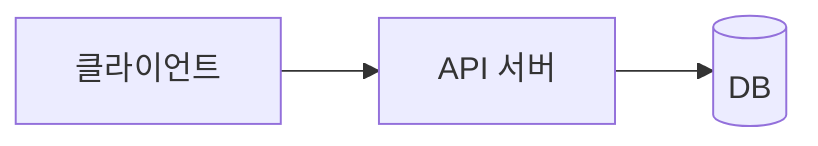

# 포트폴리오 (GitHub Pages)

**렌더러(`index.html`·`resume.html`) + 내용(`content/`)** 구조입니다. 두 페이지 모두 같은 `content/`를 읽으므로 **마크다운만 고치면 둘 다 갱신**되고, 브라우저 인쇄로 깔끔한 PDF가 나옵니다.

## 폴더 구조

```
index.html              메인 포트폴리오 — 레이아웃·디자인·렌더링 (보통 건드릴 일 없음)
resume.html             이력서 한 장 (/resume.html) — 같은 content/ 를 읽어 A4 1장으로 렌더
content/
├─ intro.md             이름·소개·연락처 (상단 frontmatter + 본문)
├─ manifest.json        카테고리 목록 + 프로젝트 표시 순서
└─ projects/
   ├─ settlement-engine.md
   ├─ search-api.md
   └─ ...               프로젝트 1개 = 파일 1개
```

## 1. 내용 수정하기 (마크다운만)

### 소개 — `content/intro.md`

상단 `--- ... ---`(frontmatter)에 정보를, 그 아래에 소개 본문을 적습니다.

```markdown
---
name: 김재현
role: Backend / Platform Engineer
headline: 안녕하세요, **데이터로 문제를 푸는** 개발자 김재현입니다.
lead: 한 줄 소개 문장.
email: robot032195@gmail.com
github: https://github.com/cozykim
site: https://cozykim.github.io
location: Seoul, Korea
---
여기에 소개 본문(마크다운)을 자유롭게 작성합니다.
```

- `headline`의 `**강조**` 부분은 자동으로 컬러 그라데이션 처리됩니다.

### 프로젝트 추가 — `content/projects/새이름.md`

파일을 하나 만들고 아래 형식으로 작성한 뒤, **`manifest.json`의 `projects` 목록에 파일 경로를 추가**하면 끝입니다.

```markdown
---
title: 프로젝트 이름
category: 백엔드 · 플랫폼        # manifest.json 의 카테고리 이름과 일치해야 함
summary: 카드에 보이는 한 줄 요약.
stack: Python, Kafka, Redis      # 쉼표로 구분
links: GitHub | https://...      # "라벨 | URL", 여러 개는 ; 로 구분
highlights: 정산 파이프라인 설계 || 처리량 **3배 개선** || 무중단 **장애 0건** 운영   # 이력서(/resume.html) 전용 불릿, "||" 로 구분
---
### 배경
...
### 한 일
- ...
### 성과
- ...
```

`###` 제목과 목록·문단은 "상세 보기"를 펼쳤을 때 그대로 렌더링됩니다.

### 아키텍처 다이어그램 넣기 (mermaid)

프로젝트 .md 본문에 ` ```mermaid ` 코드블록을 쓰면 자동으로 다이어그램으로 그려집니다.

````markdown
### 아키텍처

````

`flowchart`, `sequenceDiagram`, `erDiagram` 등 [mermaid 문법](https://mermaid.js.org)을 그대로 쓸 수 있습니다.

### 이미지(스크린샷 등) 넣기

이미지 파일을 `content/projects/assets/` 같은 폴더에 두고, 마크다운 이미지 문법으로 참조합니다.

```markdown

```

경로는 해당 .md 파일 기준 상대경로입니다(예: `content/projects/foo.md` → `assets/`는 `content/projects/assets/`).

> 참고: mermaid·이미지는 **전체 PDF**에는 포함되고, **1장 요약 PDF**에서는 공간 절약을 위해 자동 생략됩니다.

### 카테고리 추가/순서 변경 — `content/manifest.json`

```json
{
  "categories": [
    { "name": "백엔드 · 플랫폼", "desc": "서비스 핵심 시스템 설계와 운영" }
  ],
  "projects": ["projects/settlement-engine.md"]
}
```

- `categories` 순서 = 화면에 보이는 카테고리 순서
- `projects` 순서 = 각 카테고리 안에서의 프로젝트 순서

### 디자인 색상

`index.html` 상단 `:root`의 `--accent`, `--accent-2` 값만 바꾸면 포인트 컬러가 전체에 적용됩니다. (이력서 `resume.html`은 자체 `:root`의 `--blue` 값을 씁니다.)

## 이력서 페이지 `/resume.html` — 어떻게 구성되나

메인 포트폴리오(`index.html`)와 별개인 **독립 이력서 페이지**입니다. 별도 데이터는 없고 **같은 `content/`를 그대로 읽어** A4 한 장에 맞춰 렌더링합니다 — 마크다운만 고치면 두 페이지가 같이 갱신됩니다.

### 화면 구성 (위 → 아래)

| 영역 | 출처 |
|---|---|
| 이름·직함·연락처 | `intro.md` frontmatter (`name`·`role`·`email`·`github`·`site`·`location`) |
| 한 줄 소개 | `intro.md`의 `lead` **한 문장만** (본문 단락은 메인 사이트에만 노출) |
| Experience 헤더 | `intro.md`의 `company` · `position` · `period` |
| 프로젝트 카드 | `manifest.json`의 카테고리 순서로 묶고, 각 프로젝트의 `title`·`summary` + 액션 불릿 |
| Education | `intro.md`의 `education` |
| Tech Stack | 모든 프로젝트의 `stack` 자동 집계 + `intro.md`의 `stackExtra` |

### 프로젝트 액션 불릿 — `highlights` (이력서 전용)

각 프로젝트 카드의 불릿은 frontmatter의 **`highlights`** 필드에서 옵니다.

```markdown
highlights: 증분 처리 파이프라인 설계 || Retrieval 캐싱으로 **호출량 99.4% 감소** || 추천 구좌 **CTR 3.19배 상승**
```

- 불릿은 **`||`** 로 구분하고, **만든 것 + 결과**를 짧게 한 줄로(권장 3개).
- `**텍스트**` 는 파란 굵게 처리됩니다(수치 강조용).
- 이 필드는 **이력서에서만** 쓰이고 `index.html`은 무시합니다 — 상세 설명은 본문 `### 한 일`/`### 성과`에 그대로 두면 됩니다.
- `highlights`가 없으면 본문 `### 한 일`(핵심 레이블)·`### 성과`(수치 우선)에서 **자동으로** 불릿을 구성합니다(폴백).

### A4 한 장 자동 맞춤

내용이 A4 높이를 넘으면 JS가 페이지를 살짝 축소(zoom)해 **자동으로 한 장에 맞춥니다.** 프로젝트·불릿을 늘릴수록 글자가 작아지므로, 불릿은 1줄로 간결하게 유지하는 편이 보기 좋습니다. 우측 상단 **"PDF로 저장"**(또는 `Cmd/Ctrl+P`)으로 A4 1장 PDF를 뽑습니다.

## 2. 로컬에서 미리보기 (중요)

마크다운을 자바스크립트로 불러오기 때문에, **`index.html`을 더블클릭(`file://`)하면 내용이 안 보입니다.** 폴더에서 간단한 서버를 띄워 확인하세요.

```bash
cd 이폴더
python -m http.server 8000
# 메인:  http://localhost:8000
# 이력서: http://localhost:8000/resume.html
```

> GitHub Pages에 올리면 HTTP로 제공되므로 정상 동작합니다. 단, **루트에 `.nojekyll` 빈 파일이 반드시 있어야 합니다.** 없으면 GitHub Pages 기본 Jekyll 빌드가 frontmatter(`---`)가 있는 `.md`를 HTML로 변환해버려, JS가 불러올 원본 `.md`가 사라지고 소개·프로젝트가 빈 화면으로 나옵니다.

## 3. GitHub Pages로 배포

`index.html`과 `content/` 폴더를 **함께** 올려야 합니다.

### 방법 A. 사용자 사이트 (`cozykim.github.io`) — 현재 적용된 방식

1. 루트에 `.nojekyll` 빈 파일을 둔다 (Jekyll 비활성화, 필수)
2. GitHub에서 `cozykim.github.io` 이름으로 새 저장소 생성 (반드시 이 이름) 후 push

   ```bash
   touch .nojekyll                 # 필수: 없으면 .md 가 404
   git init
   git add .                       # .gitignore 가 산출물·실험본 자동 제외
   git commit -m "portfolio"
   git branch -M main
   git remote add origin https://github.com/cozykim/cozykim.github.io.git
   git push -u origin main
   ```

   > GitHub CLI(`gh`)가 있으면 `gh repo create cozykim.github.io --public --source=. --push` 한 줄로 저장소 생성 + push가 끝납니다. 사용자 사이트(`*.github.io`)는 Pages가 자동 활성화됩니다.

3. 잠시 뒤 `https://cozykim.github.io` 접속

### 방법 B. 프로젝트 사이트 (`cozykim.github.io/portfolio`)

1. 아무 이름의 저장소(예: `portfolio`)에 `index.html` + `content/` + `.nojekyll` push
2. 저장소 **Settings → Pages → Build and deployment**
3. Source를 **Deploy from a branch**, 브랜치 `main` / 폴더 `/(root)` 선택 후 Save
4. `https://cozykim.github.io/portfolio` 접속

## 4. PDF로 추출하기 (2가지 버전)

페이지 우측 하단에 버튼이 2개 있습니다.

- **⤓ 1장 요약 PDF** — A4 한 장에 소개·프로젝트 핵심·기술스택·경력만 압축. 빠르게 훑는 용도.
- **⤓ 전체 PDF** — 프로젝트 상세(배경/한 일/성과)까지 모두 펼쳐서 출력하는 풀 버전.

버튼 → 인쇄 대화상자에서:

1. 대상을 **PDF로 저장(Save as PDF)** 선택
2. 옵션에서 **배경 그래픽(Background graphics)** 체크 — 포인트 컬러가 살아납니다
3. 저장

두 버전 모두 네비/버튼이 자동으로 숨겨지고 A4 문서 레이아웃이 적용됩니다.

## 팁

- 커스텀 도메인: Settings → Pages → Custom domain
- 내용 수정 후 배포: `content/`의 마크다운만 고쳐 `git add . && git commit && git push` → 1~2분 뒤 사이트 반영.
- `.md` 파일을 새로 추가해도 `.nojekyll` 덕분에 그대로 서빙됩니다(이 파일이 없으면 다시 404).
