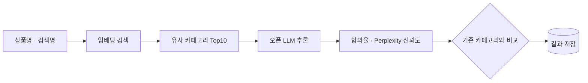

### 배경

전시카테고리가 잘못 매핑되면 검색·진열 품질이 떨어지지만, **7천만 개 이상의 상품과 3,360여 개 leaf 카테고리**를 사람이 교정하는 것은 불가능. 오매핑을 자동으로 찾아 고치는 파이프라인 필요

### 핵심 결정

- **LLM 단독 분류 대신 임베딩 후보 축소 → LLM 판단의 2-Step** — 수천 개 카테고리를 LLM에 직접 주면 혼동이 크고 전수 추론 비용도 비현실적. 임베딩으로 Top10을 좁힌 뒤 LLM이 고르는 구조로 정확도와 비용을 함께 확보. 정답이 후보에 없으면 LLM 성능과 무관하게 실패하므로, 모델 교체보다 검색 품질 개선을 우선하는 기준 정립
- **분류 신뢰도를 수치로 정의** — 수백만 건을 전수 검토할 수 없어 "무엇을 의심할지"가 먼저 필요. 다회 추론 합의율과 출력 perplexity로 신뢰도를 계산해 자동 보정·수동 검수·판단 유보로 분기
- **저성능 카테고리를 모델 문제가 아닌 구조 문제로 진단** — 저성능 구간의 절반이 "기타" 계열이었고 t-test로 이 그룹의 perplexity가 유의하게 높음을 확인. 모델 튜닝 대신 카테고리 체계 재설계와 해당 그룹 제외로 대응

### 한 일

- **입력 조합을 바꿔가며 5단계 실험** — 상품명 단독부터 표준카테고리·검색명·OCR 추가, 최종 2-Step까지 비교해 채택. 오픈 LLM을 vLLM으로 자체 서빙
- **카테고리 모호성 점수화** — 형제 카테고리 혼동율, 이름 유사도, 오매핑율을 가중 합산해 구조적으로 모호한 카테고리를 식별, 체계 개선과 검수 우선순위에 활용
- **연동 팀과 운영 규약 합의** — 데이터 수신·전송 방식, 카테고리 개편 시 중지·재구동 순서, 팀 간 다르게 쓰던 용어 통일

### 성과

- **오매핑 의심 건에서 LLM 제안 정답률 70.6%** — 기존 카테고리 정답률 40.4% (의심 건 109건 수동 검수 기준)
- **그로서리 348.4만 건 중 오매핑 77.4만 건(22.2%) 검출, 56.8만 건(73.3%) 자동 재분류**
- 신뢰도 지표 기반으로 자동 보정 구간과 수동 검수 대상을 나누는 **분석 대시보드 구축**
- 패션·쿠폰 등 분류가 본질적으로 모호한 카테고리의 한계를 실험으로 명확화

### 2-Step 파이프라인

