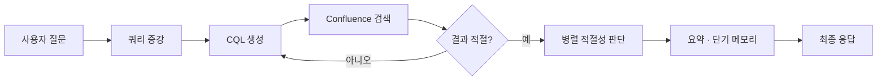

### 배경

방화벽으로 외부 AI 서비스 사용 불가, 사내 검색은 키워드(exact match) 기반이라 정확한 단어를 모르면 방대하고 파편화된 사내 문서 도달이 어려운 상황. 인사·운영팀에 반복되는 규정 문의와 분산된 담당자(R&R) 정보 탐색 비용도 큰 문제

### 핵심 결정

- **프레임워크 없이 ReAct를 직접 구현하는 것부터 시작** — 추상화에 기대기 전에 에이전트 루프를 직접 제어해 RAG 동작을 완전히 이해하는 쪽을 우선, 도구 수·모델 교체 요구가 커진 시점에 LangChain Agent + MCP로 전환해 유연성 확보
- **CQL 실패 대응을 단순 재시도가 아닌 Evaluator-Optimizer 루프로 설계** — 사내 Confluence는 필드·연산자가 제한적이라 같은 쿼리 반복보다, LLM이 오류 원인·0건 결과를 피드백받아 CQL을 재작성하는 구조가 검색 성공률에서 우위

### 한 일

- **전사 최초 AI Agent를 단독 설계·개발·운영** (PoC → 운영)
- 여러 CQL 결과 문서를 동시에 검사하는 **병렬 적절성 판단** 적용
- Confluence CQL 사용 가이드를 컨텍스트로 주입해 tool-calling 신뢰성 확보, Streamlit 대화형 UI 개발
- **사내 테크 블로그에 개발기 기고**로 에이전트 패턴 사내 공유

### 성과

- 전사 임직원 + 셀러 상담사가 활용
- 파편화된 담당자 정보·사내 규정을 단일 대화형 인터페이스로 통합, 반복 문의를 자동 응답화
- 회고: 측정 가능한 NFR(TTFT·평균 응답시간)을 초기에 정의하는 것의 중요성을 체감

### 워크플로우

