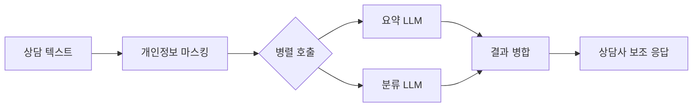

### 배경

상담사가 상담 유형(4depth)을 수기로 고르고 요약을 직접 작성하는 비효율. 상담 원문의 개인정보를 안전하게 다루면서 5초 안에 응답해야 하는 제약

### 핵심 결정

- **분류는 임베딩 검색 대신 전체 목록 프롬프트 + 캐싱** — 도메인 특화 용어가 많아 범용 임베딩으로는 검색 품질 보장이 어렵고, 파인튜닝은 배포 일정 안에 검증 불가. 즉시 검증 가능한 방식을 택하고 프롬프트 캐싱으로 비용 부담 상쇄
- **요약과 분류를 분리해 병렬 호출** — 소형 모델에 두 task를 한 번에 맡기면 품질 저하. 분리하면 호출당 출력 토큰이 줄어 속도와 정확도가 함께 개선되고, 한쪽 실패가 전체로 번지지 않음

### 한 일

- **5초 SLA 보장** — 마스킹·LLM 호출·파싱 전 구간에 단일 타임아웃, 초과 시 폴백 응답
- **운영 안정성** — 멀티 계정·리전 로테이션으로 쓰로틀링 분산, 재시도·헬스체크·부하 테스트
- **개인정보 보호** — 11종 마스킹 적용 및 마스킹이 요약 품질에 미치는 영향 검증
- **요구사항 조율** — 기획 검토 단계에서 검증되지 않은 기술 도입 범위를 조정하고 이관 시 R&R 정리

### 성과

- **연 약 2.16억 원 절감** — 상담 1건당 요약 10초·유형 선택 5초 단축 기준
- **분류 정확도 약 95%** (상담사 실제 선택 대비), 소형 모델 기반
- **처리 시간 10초 → 5초**, **LLM 비용 약 60% 절감**
- **전 채널 합산 일 약 1.1만 건** 안정 처리

### 호출 구조

