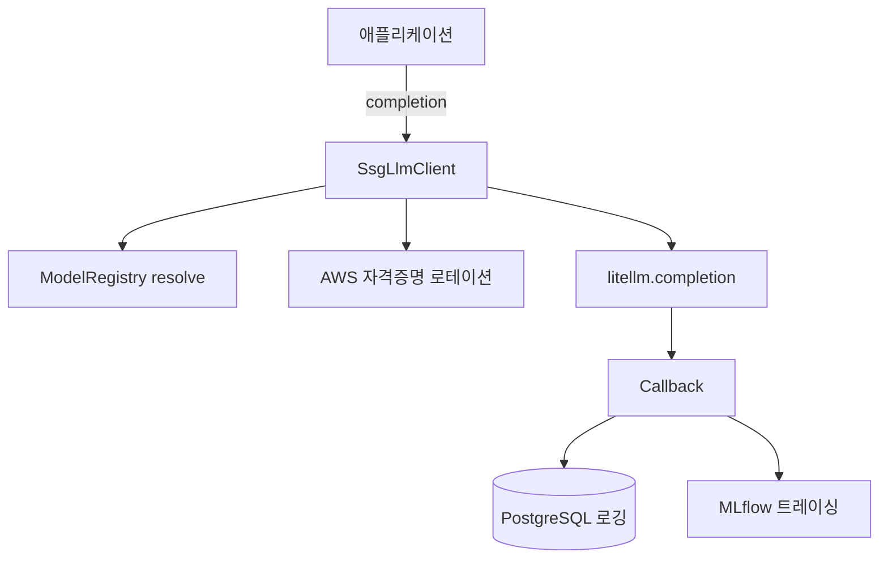

### 배경
LLM API·쇼핑 AI·셀러 Agent 등 여러 프로젝트가 프로바이더별 호출 코드를 중복 작성하는 상황. 모델 교체·자격증명 관리·로깅이 제각각이라 팀 전체의 LLM 개발 생산성 저하

### 핵심 결정
- **멀티 프로바이더 어댑터를 직접 구현하지 않고 LiteLLM을 코어 엔진으로 채택** — 프로바이더별 인증·오류 코드·파라미터 차이를 직접 추상화하면 신규 추가마다 코드 수정이 필요해, LiteLLM에 해당 레이어를 위임하고 사내 패키지는 모델명 매핑·자격증명 로테이션·로깅 표준화로 범위 집중
- **모델 매핑을 코드가 아닌 YAML 카탈로그로 분리** — LLM 출시 주기가 빨라 모델명을 코드에 박으면 교체마다 배포가 필요하므로, YAML 카탈로그로 분리해 환경변수와 한 줄 추가만으로 신규 모델 활성화
- **관측 인프라 장애가 추론을 막지 않도록 Graceful Degradation 설계** — 로깅·트레이싱은 부가 기능인데 MLflow·DB 장애가 LLM 호출 실패로 전파되면 주객이 전도되므로, "MLflow·DB가 다운돼도 추론 요청은 정상 응답"을 완료 기준으로 정의하고 장애 시나리오를 단위 테스트로 커버해 격리 보장
- **MLflow trace span 누락을 비동기 로깅 순서 제어로 해결** — LiteLLM이 acompletion 완료 후 create_task로 로깅을 스케줄해 span이 먼저 닫히면 orphan trace가 생기는 문제를, sleep(0)으로 로깅 큐 적재를 보장한 뒤 flush해 순서를 확정, DB 쓰기는 flush 범위 밖에 둬 응답 지연·trace 정합성 동시 확보

### 한 일
- Azure OpenAI · AWS Bedrock · Gemini · vLLM을 **단일 인터페이스로 제공**, SSG 모델명 → LiteLLM 모델명 매핑을 모델 레지스트리로 관리
- **AWS Bedrock 멀티 계정(최대 10) 라운드로빈 로테이션**으로 쓰로틀링 분산
- 백그라운드 스레드 기반 **DB 로깅 + MLflow 트레이싱**(호출당 토큰·캐시 히트 집계) 표준화
- **사내 PyPI wheel 배포 프로세스** 구축, 확장 가이드(새 모델·새 프로바이더) 문서화

### 성과
- 팀 내 LLM 호출을 단일 패키지로 표준화해 신규 서비스의 LLM 연동 비용 절감
- llm-api 프로젝트에 우선 적용 후 wheel 배포 파이프라인까지 완성

### 요청 흐름

