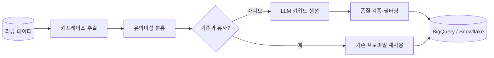

### 배경
수십만 개 상품 중 상당수가 카테고리·가격 외에 의미 있는 속성 정보가 없어 검색 커버리지와 추천 정확도가 동시에 낮은 상태. 상품 상세에 없는 **실제 사용 경험은 리뷰에 담겨 있다**는 점에 착안, 2023년 2월 탐색기로 시작해 검색창·장바구니·쇼핑 AI까지 적용 범위 확장

### 핵심 결정
- **리뷰 전체를 LLM에 태우지 않고, 임베딩으로 신규 건만 골라 호출** — 주 수십만 건을 전부 LLM에 넣으면 비용 감당이 불가능해, 기존 프로파일 재사용으로 정확도를 일부 포기하더라도 신규 키프레이즈/키워드만 LLM 호출(결과적으로 호출량 약 0.6%)
- **Cold Start를 별도 모델 없이 "동일 유입검색어 프로파일 공유"로 해결** — 리뷰 없는 신규 상품에 모델을 추가 학습·구축하는 대신 같은 검색어로 유입된 상품군의 프로파일을 공유, 추가 인프라 없이 해결하되 너무 범용적인 검색어는 특이성이 희석돼 공통 제외 키워드로 보완

### 한 일
- **증분 처리 파이프라인 설계** (Airflow) — 형태소·POS 패턴 키프레이즈 추출 → 유의미성 분류 → 클러스터링 → LLM 키워드 생성 → 품질 검증 → DW 저장 워크플로우
- **키프레이즈 유의미성 분류기 구축** (PyTorch, ELECTRA 기반 fine-tuning) — 직접 라벨링 + 클러스터링 샘플링·pseudo labeling으로 약 5천 건 학습셋을 구축해 specific/other 이진 분류, LLM 호출 전 의미 있는 키프레이즈만 선별하고 생성된 키워드 품질 재검증에도 활용
- **LLM 키워드 추출 프롬프트** — Dynamic Few-shot(임베딩 + BM25), Prompt Chaining·CoT·Self-Refine 조합, 비동기 배치 + 재시도(tenacity)
- 장바구니 추천 랭킹 로직 설계, LLM API 전환(Gemini → Claude) 및 Haiku 비용 최적화
- **검색 팀 대상 인터페이스 문서화** — 데이터 전달 방식, Airflow 설정, DB 컬럼 규칙을 사내 위키에 정리하고 ERD와 배치 주기 공유로 연동 타이밍 조율. 외부에 노출하는 속성명과 내부 코드·DB 명칭을 구분하는 컨벤션도 정의해 교차 참조 시 혼동 방지

### 성과
- **장바구니 추천 구좌 CTR 약 3.19배 상승**, 장바구니 구좌 전체 **CTR 2위** 기록 (저효율 구좌 대체)
- Retrieval 캐싱으로 **LLM 호출량 약 99.4% 감소** (전체 대비 약 0.6%만 호출)
- 주 40만 건 규모 리뷰 증분 처리 안정 운영, 뷰티·식품 → 전체 카테고리 확장

### 파이프라인

