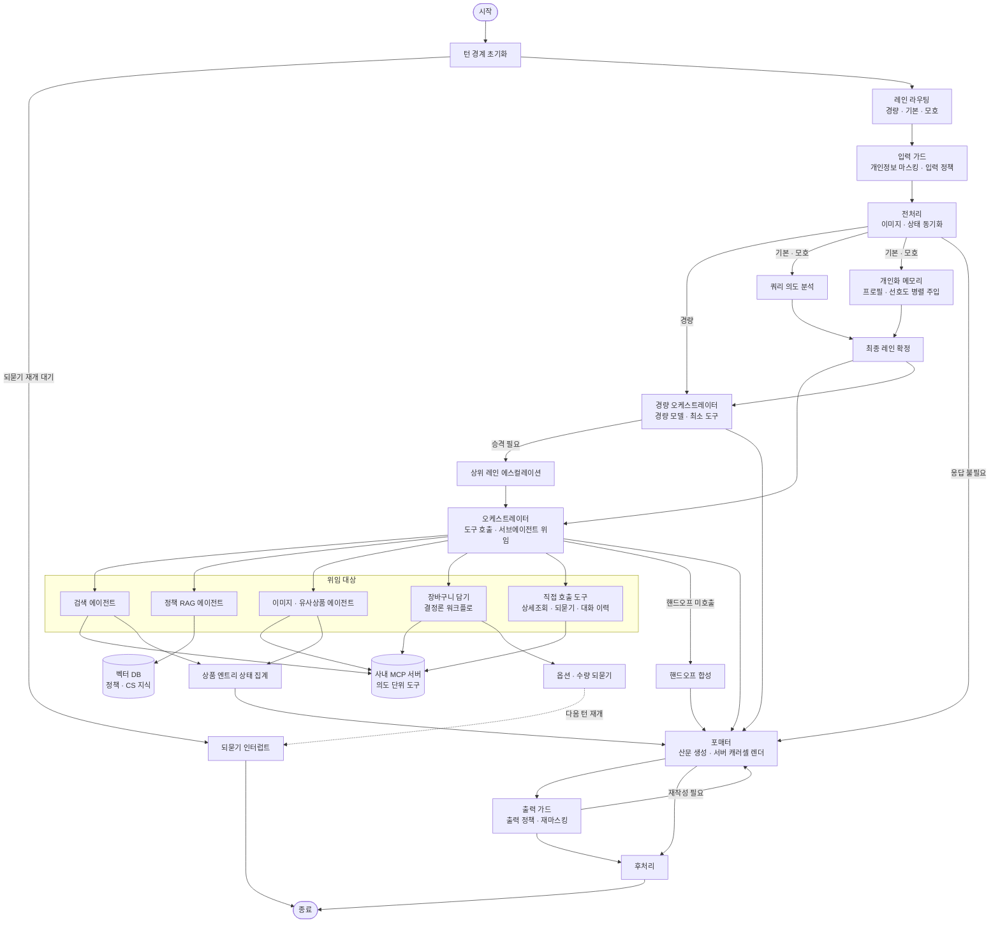

### 배경

키워드 매칭으로는 "가성비 좋은 선물" 같은 발화 처리 불가. 의도가 복합적일수록 매칭할 키워드 자체가 소멸

1차 버전은 알파 테스트에서 품질 한계 노출. 원인을 **검색 정확도, 클라우드 종속, 평가 체계 부재, 도구 호출 신뢰성** 4가지로 정의, **전면 재설계하는 2차부터 합류**해 구조 설계 담당

### 설계 원칙

- **Tool과 Sub-agent의 기준은 "ReAct 루프 필요 여부"** — 고정된 조회는 tool, 중간 판단이 필요할 때만 sub-agent. 불필요한 서브에이전트는 재개 시 노드가 2회 실행되는 문제로 제거
- **LLM이 만들지 않아도 되는 건 결정론 코드로** — 렌더, 라우팅, 파라미터 주입은 코드가 담당, LLM에는 판단만 위임
- **비용 라우팅에 분류 LLM 미추가** — 명확한 발화는 규칙으로, 회색지대는 기존 쿼리 분석 결과 재사용. 오분류는 상위 레인으로 승격
- **MCP 도구는 API 계층이 아닌 사용자 의도 단위로** — 계층별 노출 시 단계마다 추론이 끼어 지연 누적. 다단계 조회는 MCP 안에서 끝내도록 연동 팀과 협의

### 한 일

- **에이전트 아키텍처** — 오케스트레이터 + 도메인별 서브에이전트(검색·정책 RAG·이미지) 구조. 의도 5축 분석으로 도구 선택, 응답 속도 최적화를 위해 LLM과 결정론 워크플로 혼합 사용 구조 설계
- **미들웨어 파이프라인** — 개인화 메모리, 페르소나 해석, 병렬 투두, 컨텍스트 2단 방어, 도구 재시도를 커스텀 미들웨어로 구현
- **응답 생성의 결정론화** — 상품 블록을 서버 state 렌더로 이관. **출력 토큰이 상품 수와 무관**해지고 상품명·ID 환각 제거 및 응답속도 최적화
- **메모리 State 개편** — LLM에는 판단에 필요한 정보만 노출하고, 실제 API 통신에 필요한 파라미터 값은 LLM이 보지 못하는 별도 메모리에 보관. 도구 호출 시 코드가 item id로 파라미터를 주입해 컨텍스트 토큰 절감과 ID 환각 차단
- **개인화와 되묻기(HITL)** — 개인화 선호도 영속화를 응답 경로 밖으로 빼 레이턴시 영향 0. 되묻기는 공통 HITL Runtime으로 설계
- **도구 계약과 평가 인프라** — 빈 결과로 내려오던 도구 실패를 명확한 실패 응답으로 분리. 아키텍처 버전별 비교하는 벤치마크 대시보드 구축

### 트러블슈팅

- **경량 모델이 바인딩 안 된 툴을 호출** — unknown tool 에러를 오류가 아니라 **"상위 모델이 필요하다는 신호"로 재해석**해 에스컬레이션으로 재작성(사후 교정). 경량 전용 프롬프트도 분리(사전 예방)
- **HITL 재개 후 응답이 안 나옴** — 원인은 일시정지된 그래프에 상태를 쓰면 새 체크포인트가 대기 중인 인터럽트를 지우는 것. 누적 답변을 체크포인터 밖 저장소로 이동해 해결

### 한 턴의 실행 흐름

발화 복잡도로 경량/기본 레인을 나누고, 응답 생성과 가드를 그래프 구조로 강제하는 것이 이 토폴로지의 핵심

